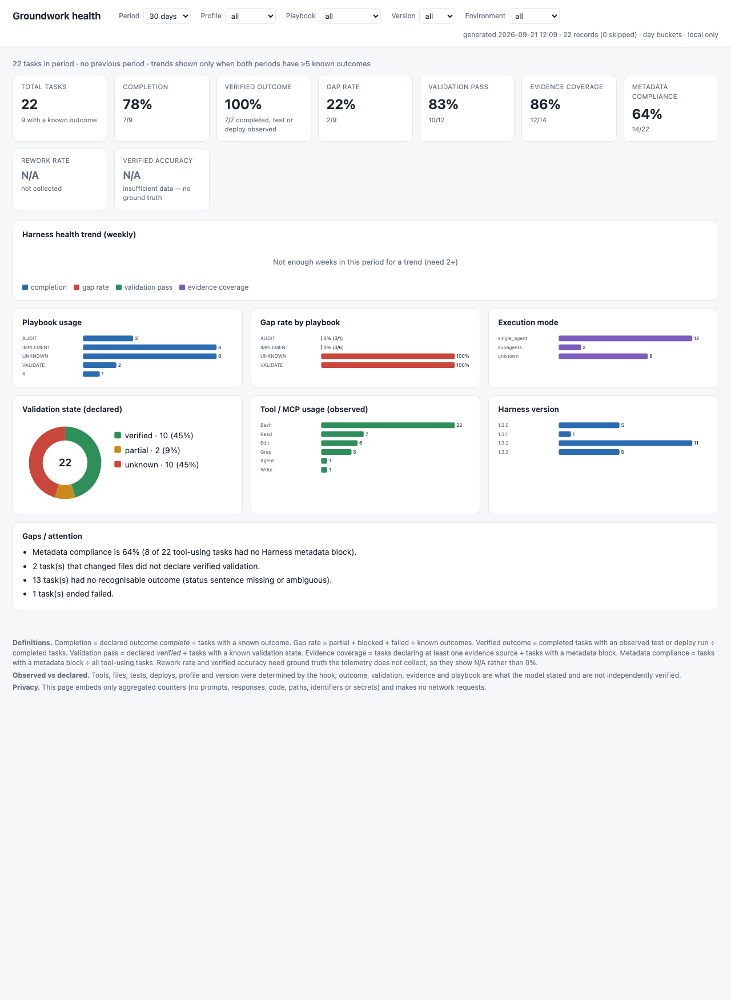

# Groundwork

**A small, evidence-first engineering harness on top of [ECC](https://github.com/affaan-m/ECC) and [OpenSpec](https://github.com/Fission-AI/OpenSpec) for Claude Code.**

Groundwork is not a fork or a redistribution of ECC or OpenSpec — it installs both from their own official sources and adds a thin governance layer on top: three rule files that route work by risk tier, guide architecture quality, and stop completion claims from outrunning proof; and three small deterministic hooks — a push guard, an enforced independent review for material changes, and a session-start snapshot of the repository so a fresh session can continue an existing project. That's the whole product: three rule files, three hooks, an installer. No new agents, no new skills, no plugin ecosystem, no daemon, no database.

Built and validated by **Ashmin** ([@AshminPy](https://github.com/AshminPy)) — see [CREDITS.md](CREDITS.md) for exactly what's original here versus what's installed from upstream.

## Why this exists

ECC ships 68 agents and 286 skills that are excellent once invoked — but nothing invokes them on its own. Left alone, a plain request to "add X" gets implemented without a plan, without tests, without review, and the final report says it's done regardless. OpenSpec gives you a real spec-driven change lifecycle, but only when you run `/opsx:*` — and even then, nothing stops an agent from claiming a change is complete with a failing test still in the suite. And neither one tells Claude *what a good design is*, *when to delegate*, or *how to pick a project back up next week*.

Groundwork closes exactly those gaps, and nothing else:

1. **Route by risk, not by ceremony.** A one-line fix shouldn't get a spec. A production-facing change should. `rules/engineering-workflow.md` defines three tiers and what each one requires.
2. **Design for the change you can see, not the one you imagine.** `rules/architecture-quality.md` gives the governing principle — the smallest design that satisfies today's requirement while keeping low-cost paths for foreseeable change — plus the questions to answer before material work and the rule for variation points (environments, providers, clusters, models, regions, tenants belong behind configuration, not hard-coded).
3. **Evidence beats intuition, always.** Every material technical decision cites a real source; every completion claim shows the command and the result; validation climbs a ladder derived from the project's own tooling and ends at the real runtime when runtime matters. `rules/evidence-policy.md` sets the rules and the labels (VERIFIED / UNVERIFIED / ASSUMPTION / INFERENCE / RUNTIME VALIDATION REQUIRED).
4. **Delegation is Claude's decision, not the user's.** The workflow rule says when to stay in the main session, when to use a subagent, and when Claude Code's native Agent Teams are justified — you never have to say "create four agents".
5. **Independent review is enforced, not requested.** `hooks/require_material_review.py` is a Stop hook that will not let a session end if a spec-driven change is fully implemented and nothing that looks like a reviewer — an ECC reviewer, a subagent, or an Agent Team reviewer teammate — ever ran against it. See [docs/VALIDATION.md](docs/VALIDATION.md).
6. **Continuation comes from the repository.** `hooks/groundwork_session_snapshot.py` injects a deterministic snapshot at every session start — branch, dirty files, OpenSpec task progress, the verification commands the repo declares — and the workflow rule tells Claude how to rebuild a DONE / PARTIAL / MISSING / BLOCKED / UNVERIFIED picture from git, OpenSpec, docs, tests and code before touching anything.

## Architecture

```
                    USER GOAL
                        │   ← session-start snapshot (git · OpenSpec · commands) injected first
                        ▼
   rules/engineering-workflow.md  ──  classifies TRIVIAL / STANDARD / MATERIAL,
                        │             picks main session / subagents / Agent Team
        ┌───────────────┴───────────────┐
        ▼                                ▼
     OpenSpec                          ECC
  WHAT / WHY / acceptance        HOW: agents, skills,
  criteria as scenarios          GateGuard, session
  (per-repo, file-based)         persistence, learning
        │                                │
        └───────────────┬───────────────┘
                         ▼
   rules/architecture-quality.md — smallest design, variation
        points as config, no abstraction without a reason
                         ▼
         rules/evidence-policy.md — decisions cited, validation
          ladder to the real runtime, claims proven, labels honest
                         ▼
       hooks/require_material_review.py — Stop hook,
         blocks completion without independent review
                         ▼
              COMPLETION STATUS block
   Code / Tests / Reviewed / Merged / Deployed / Live validated
      → COMPLETE / PARTIAL / BLOCKED / PLANNED / FAILED
```

Full detail: [docs/ARCHITECTURE.md](docs/ARCHITECTURE.md).

## Quick start

Requirements: Claude Code ≥ 2.1, Node ≥ 18, npm, Python 3.10+, git.

```bash
git clone https://github.com/AshminPy/groundwork.git
cd groundwork
./install.sh                 # ECC + OpenSpec + Groundwork rules/hooks, merged into ~/.claude
./install.sh --agent-teams   # optional: also opt in to Claude Code's experimental Agent Teams
```

This installs ECC (official plugin path), the OpenSpec CLI (official npm package), and Groundwork's three rule files and three hooks into `~/.claude/`, merging into your existing `settings.json` without touching anything else you've configured (see [scripts/merge_settings.py](scripts/merge_settings.py) for exactly what it changes). A pre-Groundwork copy of the rules under `~/.claude/rules/harness/` is moved to a backup so nothing loads twice.

Per project, once, if you want spec-driven work there:
```bash
cd your-project
openspec init --tools claude
```

That's it. Start a normal Claude Code session and give it an engineering task — or open an existing project and say **"Continue this project."**

## What each tier actually requires

| Tier | Example | Process |
|---|---|---|
| TRIVIAL | typo, one-line config value | Just do it, run the narrowest check |
| STANDARD | bug fix, small feature | Inline plan naming the quality dimensions that apply → tests from the project's own commands → self-review → verify → status |
| MATERIAL | architecture, security, production behavior, external interfaces | Understand (state table) → OpenSpec spec → architecture-quality questions + DECISION records → implement → tests → **independent review (enforced)** → verify → runtime-validate when runtime matters → deploy/live-validate if in scope → status |

Full text: [rules/engineering-workflow.md](rules/engineering-workflow.md).

## How Claude chooses main session, subagents, or an Agent Team

Simplest model that produces the result. Main session for sequential work that shares context. A subagent for a focused, isolated investigation or review whose result comes back. An Agent Team (Claude Code's native, experimental feature — enabled only by `CLAUDE_CODE_EXPERIMENTAL_AGENT_TEAMS=1`, interactive sessions only) when two or more genuinely independent workstreams benefit from parallelism or independent reasoning: architecture + implementation + validation, infrastructure + application, competing incident hypotheses, implementation plus independent security validation. Teams are sized to the work (2–4), each teammate owns its files, specialists are derived from the task, and the lead synthesizes. When teams are off or the session is `-p`, the same decomposition runs on subagents. Groundwork adds no orchestration code of its own.

## Task routing and playbooks

Every substantive request is routed to exactly one of ten task categories — RESEARCH, EXPLAIN, DESIGN, PLAN, IMPLEMENT, TROUBLESHOOT, VALIDATE, AUDIT, DEPLOY, DOCUMENT — by a small always-loaded rule, [rules/task-routing.md](rules/task-routing.md). Only that category's playbook is then read from `~/.claude/groundwork/playbooks/` (installed by `install.sh`, never auto-loaded). Each playbook has the same six sections — Goal, Workflow, Evidence, Ask Before Acting When, Completion Criteria, Output Format — and a concise category-specific answer shape. The router also carries two universal rules: ask a clarifying question only when the missing information could materially change correctness, safety, architecture, permissions, the target environment, a destructive action or the outcome; and report only what is material (result, finding, evidence, change, validation, risk, blocker, next action) with no narration of every command and file.

Every answer then follows the global output contract in [rules/output-contract.md](rules/output-contract.md): a plain-language main response first (result, what matters, what changed or is recommended, whether it was really verified, one next action when needed), then `Technical details` when useful evidence exists (errors, log paths, copyable commands, key files, tests, PR, commit), then `Evidence & references` when the conclusion depends on sources. Empty sections are omitted; technical evidence is translated into understandable language in the main response and kept exact in the details.

Substantive task responses end with a small `Harness metadata` block (four lines: `Groundwork <version> · <PLAYBOOK>`, execution, evidence types, validation — profile/environment/roles/tools only when relevant), and a fourth hook, `hooks/groundwork_telemetry.py`, appends one JSON line per substantive turn — the block is present, or at least one tool ran — to `~/.claude/groundwork/telemetry/events.jsonl` (owner-only); `declared.block_present` records whether the block was there. Each record separates **observed** facts the hook determined itself (profile from `GROUNDWORK_PROFILE`, tool and MCP names, agent calls, files-changed count, tests run, deploy-shaped commands, version) from **declared** metadata taken from the response (playbook, execution mode, evidence types, validation, outcome from the Status sentence) — declared fields are recorded as stated, not verified. Never prompt text, commands, paths, secrets or reasoning: free text is kept only as short labels. Append-only and fail-open; `GROUNDWORK_TELEMETRY=off` disables; set `GROUNDWORK_PROFILE=work` in your own `settings.json` `env` to label the profile (machine-specific, not shipped by the installer). The records are designed for later reports (playbook frequency, execution modes, tool usage, clarification and blocked rates, validation rate, trends by version); no dashboard exists yet.

This layer is additive. It never overrides the engineering workflow, the evidence policy, the architecture rule, or any hook; where a playbook and an existing rule disagree, the existing rule wins. `tests/test_playbooks.py` checks the artefacts and the install layout; `scripts/check_routing.py` runs the twelve reference scenarios through real headless sessions when the CLI is logged in.

## Health dashboard (local, no server, no LLM)



*Sample: this machine's real telemetry after the 1.4.0 install (22 records, 30-day window). Rework rate and verified accuracy show N/A because no ground truth is collected; the trend panel says so when fewer than two weeks of data exist.*

`~/.claude/groundwork/bin/groundwork_report.py` turns the telemetry file into `~/.claude/groundwork/reports/dashboard.html` — a self-contained page (inline SVG charts, no CDN, no network requests) with summary cards (total tasks, completion, verified outcome, gap rate, validation pass, evidence coverage, metadata compliance; rework rate and verified accuracy show N/A because the telemetry carries no ground truth), a weekly health trend, playbook usage, gap rate by playbook, execution mode, validation state, tool/MCP usage, harness versions, and a deterministic Gaps / attention list. Every rate shows its numerator and denominator; unknown outcomes are excluded from denominators; trends against the previous equivalent period appear only when both have at least five known outcomes. Filters (period 7/30/90/365 days or all, profile, playbook, version, environment) run in the page's own JavaScript over aggregated day buckets — the browser never reads the raw telemetry file, and nothing leaves the machine.

```bash
python3 ~/.claude/groundwork/bin/groundwork_report.py generate            # rebuild dashboard.html now
python3 ~/.claude/groundwork/bin/groundwork_report.py generate --snapshot # also YYYY-MM-DD.html and .md
python3 ~/.claude/groundwork/bin/groundwork_report.py schedule weekly     # disabled | daily | weekly | monthly | yearly
python3 ~/.claude/groundwork/bin/groundwork_report.py status
open ~/.claude/groundwork/reports/dashboard.html
```

The schedule is a macOS launchd agent (`com.groundwork.report`, default weekly, Monday 08:00; `--hour` to change) that runs `generate --snapshot` — Claude does not need to be running and no API call is made. Schedule and analysis window are separate: `~/.claude/groundwork/report.json` holds `schedule` and `window_days` (default 30). Report generation is a separate process that no hook calls, so a reporting failure cannot affect task execution or telemetry collection. Uninstall removes the job and the script but keeps `telemetry/` and `reports/`.

## The completion facts

Every STANDARD/MATERIAL task establishes six facts with evidence — Code · Tests · Reviewed · Merged · Deployed · Live validated (✅ / ❌ / N/A) — plus `Overall: COMPLETE / PARTIAL / BLOCKED / PLANNED / FAILED`, and reports them once, inside the output contract's Validation / Technical details. The aligned `STATUS` block layout is produced only when the user asks for a release/deployment checklist. Hard rules: merged ≠ complete, tested ≠ deployed, deployed ≠ live validated, code written ≠ done. A failing test — including one that was already failing before you started — makes `Tests: ❌` and `Overall: PARTIAL`, never COMPLETE. Mocks never prove runtime.

## Future direction

Groundwork stays the engineering-quality and governance layer, and it stays small. The agreed direction for the wider harness — a tiny always-loaded universal core (evidence, uncertainty, safe autonomy, untrusted-content discipline, truthful status), domain capabilities that load only when relevant (engineering via Groundwork/ECC/OpenSpec; cloud, research, documentation, presentations and others as scoped skills or rules), an automatically chosen execution model, fresh-session continuation from repository evidence rather than growing conversations, optional least-privilege MCP tooling, deterministic safety boundaries beyond Git, and a reproducible version-controlled setup — is written down in [docs/FUTURE-SCOPE.md](docs/FUTURE-SCOPE.md).

Everything there is labelled **CURRENT** (implemented, with the version it landed in) or **FUTURE**. Nothing marked FUTURE exists yet, and nothing is added until a real task exposes a gap that native Claude Code, Groundwork, ECC or OpenSpec cannot already cover. The SRE Agent pilot is the first such test.

## Does it actually work?

[docs/VALIDATION.md](docs/VALIDATION.md) is the real evidence: the actual test prompts, the actual transcripts, and what happened — including the times it didn't work on the first try and what was fixed, and a clear line between deterministic test evidence and observed model behaviour. Groundwork does not ask you to trust marketing copy about itself.

## Repository layout

```
groundwork/
├── install.sh / uninstall.sh          installer, idempotent, reversible (--agent-teams opt-in)
├── rules/
│   ├── engineering-workflow.md        tiers, execution order, autonomy, execution model, continuation, completion block
│   ├── architecture-quality.md        governing principle, dimensions as criteria, pre-MATERIAL questions, variation points
│   └── evidence-policy.md             evidence priority, labels, DECISION record, validation ladder, completion evidence
├── hooks/
│   ├── block_protected_push.py        denies push to main/master/production + force-push
│   ├── require_material_review.py     denies finishing a complete-but-unreviewed change (subagent, skill, or teammate reviewers)
│   ├── groundwork_session_snapshot.py injects a deterministic repo snapshot at session start
│   └── groundwork_telemetry.py        appends one JSONL usage record per substantive task (fail-open)
├── scripts/groundwork_report.py       health dashboard generator (installed to ~/.claude/groundwork/bin/, launchd schedule)
├── scripts/
│   ├── merge_settings.py              settings.json merge (used by install.sh)
│   ├── unmerge_settings.py            settings.json cleanup (used by uninstall.sh)
│   └── migrate_legacy_rules.py        moves a pre-Groundwork rules/harness copy to a backup
├── tests/
│   └── test_hooks.py                  the actual test suite the hooks and scripts were built against
├── openspec/                          Groundwork's own spec-driven changes (dogfooding)
└── docs/
    ├── ARCHITECTURE.md
    ├── VALIDATION.md                  real test transcripts and results
    ├── TROUBLESHOOTING.md
    ├── UPGRADE-ROLLBACK.md
    └── FUTURE-SCOPE.md                agreed direction, CURRENT vs FUTURE clearly separated
```

## License and attribution

Groundwork's own files (rules, hooks, scripts, docs) are MIT-licensed, © Ashmin — see [LICENSE](LICENSE). ECC and OpenSpec are separate, independently MIT-licensed projects installed from their own official sources, not modified or redistributed here. Full attribution: [CREDITS.md](CREDITS.md).
